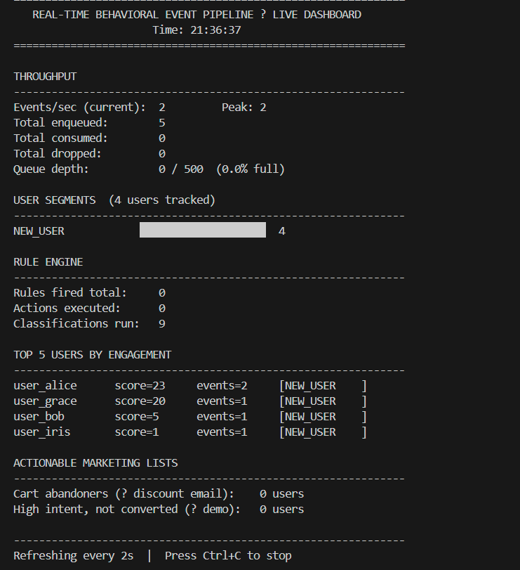
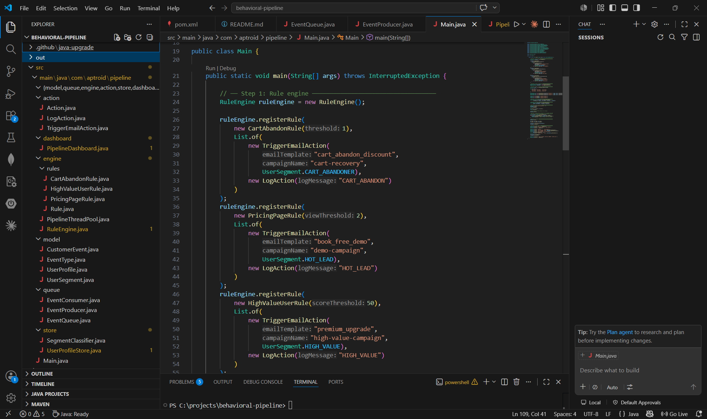
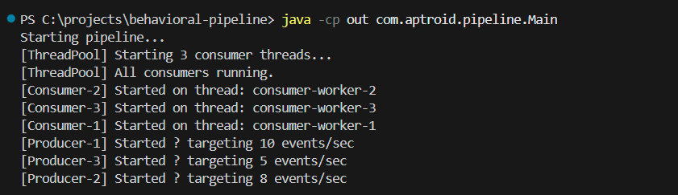
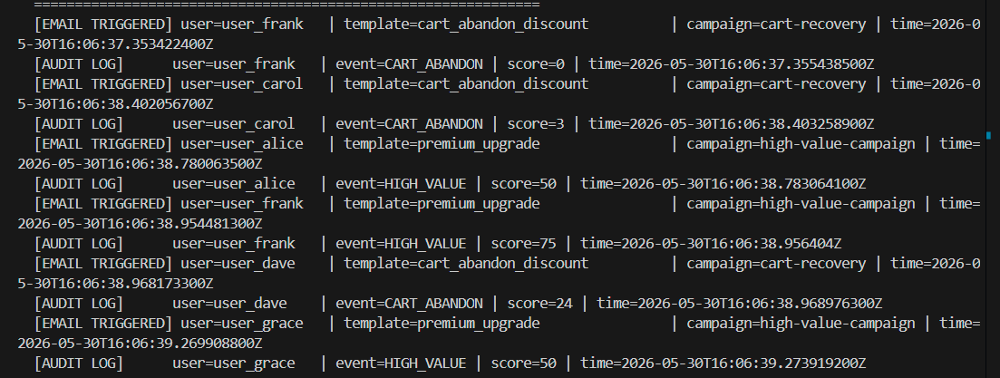
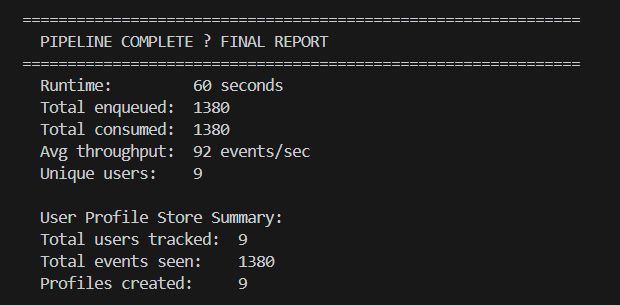
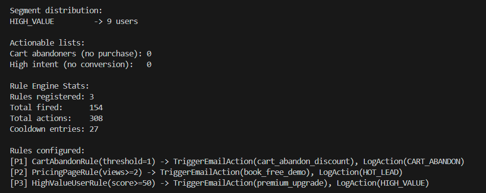

# Real-Time Behavioral Event Pipeline

> A production-inspired, real-time customer behavior tracking and
> marketing automation engine — built entirely in core Java 21 with
> zero external dependencies.

Mirrors the core architecture of marketing automation platforms
like Aptroid: customer events stream in, a rule engine evaluates
behavior in real time, and personalized actions (emails, segments)
fire automatically.

---

## Live Dashboard



*Dashboard refreshes every 2 seconds — showing live throughput,
segment distribution with progress bars, top users by engagement
score, and actionable marketing lists.*

---

## Architecture

EventProducer(s)  [3 threads — weighted random events]
│
▼  [LinkedBlockingQueue — bounded, back-pressure]
EventQueue  (capacity: 500)
│
▼  [ThreadPoolExecutor — 3 named consumer workers]
EventConsumer(s)
│
├──▶ UserProfileStore    (ConcurrentHashMap — thread-safe)
│         │
│         ▼
│    SegmentClassifier   (real-time after every event)
│         │
│         ▼
│    [HIGH_VALUE / HOT_LEAD / CART_ABANDONER / AT_RISK / NEW_USER]
│
└──▶ RuleEngine          (Strategy + Observer pattern)
│
▼
TriggerEmailAction    (simulates SendGrid / Mailchimp API)
LogAction             (audit trail)
PipelineDashboard  (ScheduledExecutorService — fixed-rate 2s refresh)


---

## Screenshots

### Project Structure


### Pipeline Startup — 3 producers + 3 consumers launching


### Email Triggers Firing Automatically


### Final Pipeline Report


### Segment Distribution


---

## What It Does

- **Ingests** customer behavioral events in real time
  (PAGE_VIEW, PRICING_VIEW, CART_ADD, CART_ABANDON, PURCHASE...)
- **Tracks** each user's full behavior profile automatically
- **Classifies** users into segments after every single event
- **Fires rules** automatically when behavior conditions are met
- **Triggers** personalized email actions instantly
- **Displays** a live CLI dashboard refreshing every 2 seconds

---

## Deep Java Concepts Demonstrated

### Concurrency — zero external libraries

| Concept | Class | Why This Choice |
|---|---|---|
| `LinkedBlockingQueue` | EventQueue | Back-pressure: producers block when full, consumers block when empty. No explicit locks needed. |
| `ThreadPoolExecutor` | PipelineThreadPool | Full control: queue type, thread naming, rejection policy — impossible with factory methods |
| `ConcurrentHashMap` | UserProfileStore | Segment-level locking — 16 concurrent writes with zero contention between different users |
| `AtomicInteger` | UserProfile | Single CAS instruction vs 3-step int++ — prevents lost updates under concurrency |
| `AtomicBoolean` | EventProducer | Cross-thread shutdown signal — volatile visibility guaranteed |
| `volatile` | UserProfile.lastSeen | Memory barrier — prevents CPU register caching across threads |
| `ScheduledExecutorService` | PipelineDashboard | Fixed-rate scheduling — no drift unlike Thread.sleep() loops |
| `computeIfAbsent` | UserProfileStore | Atomic get-or-create — prevents duplicate profile creation race condition |

### Design Patterns

**Strategy Pattern — Rule Engine**
```java
public interface Rule {
    boolean evaluate(UserProfile profile);
    String getRuleName();
    int getPriority();
}
// Add new rule = create one class. Zero changes to RuleEngine.
// Open/Closed Principle.
```

**Observer Pattern — Actions**
```java
public interface Action {
    void execute(UserProfile profile);
}
// One rule fires → multiple actions execute.
// CartAbandonRule → TriggerEmailAction + LogAction
// Rules and actions completely decoupled.
```

**Producer-Consumer Pattern**
```java
// Producer — blocks if queue full (back-pressure)
queue.offer(event, 100, TimeUnit.MILLISECONDS);

// Consumer — blocks if queue empty (no busy-spinning)
queue.poll(1, TimeUnit.SECONDS);
```

### Memory Model Awareness

```java
// WRONG — not atomic under concurrency
count++;  // read + increment + write = 3 ops, race condition

// RIGHT — single CAS hardware instruction
counter.incrementAndGet();  // atomic, lock-free

// WRONG — two operations, not atomic
if (!map.containsKey(userId)) map.put(userId, new UserProfile());

// RIGHT — single atomic operation
map.computeIfAbsent(userId, UserProfile::new);
```

---

## Project Structure

src/main/java/com/aptroid/pipeline/
├── model/
│   ├── CustomerEvent.java       # Immutable — thread-safe by design
│   ├── EventType.java           # Enum: PAGE_VIEW, CART_ADD, PURCHASE...
│   ├── UserProfile.java         # AtomicInteger counters, volatile fields
│   └── UserSegment.java         # HIGH_VALUE, HOT_LEAD, CART_ABANDONER...
├── queue/
│   ├── EventQueue.java          # Bounded BlockingQueue + back-pressure
│   ├── EventProducer.java       # Runnable, weighted random events
│   └── EventConsumer.java       # Runnable, profile update + rule eval
├── engine/
│   ├── RuleEngine.java          # Priority-sorted rules, cooldown logic
│   ├── PipelineThreadPool.java  # Custom ThreadPoolExecutor
│   └── rules/
│       ├── Rule.java            # Strategy interface
│       ├── CartAbandonRule.java
│       ├── PricingPageRule.java
│       └── HighValueUserRule.java
├── action/
│   ├── Action.java              # Observer interface
│   ├── TriggerEmailAction.java  # Simulates email API
│   └── LogAction.java           # Audit logging
├── store/
│   ├── UserProfileStore.java    # ConcurrentHashMap + query methods
│   └── SegmentClassifier.java   # Real-time classification logic
└── dashboard/
└── PipelineDashboard.java   # ScheduledExecutorService, ANSI display


---

## Key Design Decisions

### Why `LinkedBlockingQueue` over `ArrayList + synchronized`?
`synchronized ArrayList` locks the entire list — one thread
at a time. `LinkedBlockingQueue` gives back-pressure for free:
producers block automatically when queue is full, consumers
block when empty — no CPU wasted on busy-spinning.

### Why `ThreadPoolExecutor` directly over `Executors.newFixedThreadPool()`?
Factory methods use an **unbounded** queue — if consumers fall
behind, the queue grows forever until `OutOfMemoryError`.
Direct `ThreadPoolExecutor` construction lets you:
- Set a **bounded** queue (back-pressure)
- Name threads (`consumer-worker-1`) for instant log debugging
- Set `CallerRunsPolicy` — saturated pool slows producers naturally

### Why `computeIfAbsent` over `get()` + `put()`?

Thread A: get("user1") → null
Thread B: get("user1") → null       ← both see null
Thread A: put("user1", new Profile) ← creates profile
Thread B: put("user1", new Profile) ← OVERWRITES, loses A's events!


`computeIfAbsent` is one atomic operation — exactly one profile
per user, guaranteed, even under full concurrency.

### Why segment classification after EVERY event?
Batch classification (hourly) = stale segments = wrong emails
fired hours after the behavior. Real-time classification means
a cart abandon triggers a recovery email within milliseconds —
that's Aptroid's core product value.

---

## What I Would Do at Production Scale

| This Project | Production Equivalent | Reason |
|---|---|---|
| `LinkedBlockingQueue` | Apache Kafka | Durable, distributed, replayable |
| `ConcurrentHashMap` | Redis Cluster | Distributed user state across servers |
| In-process RuleEngine | Drools / Flink | Distributed rule processing |
| CLI Dashboard | Grafana + Prometheus | Real metrics, alerting |
| Simulated email | SendGrid / Mailchimp API | Real delivery + tracking |
| Single JVM | Kubernetes microservices | Horizontal scaling |

The core concepts — back-pressure, thread-safe state,
rule evaluation, segment classification — are identical.
The production stack adds durability and distribution.

---

## How to Run

**Prerequisites:** Java 17+

```bash
# Clone
git clone https://github.com/Kirandeep-Kaur0/behavioral-pipeline.git
cd behavioral-pipeline

# Compile (Windows)
javac -d out src\main\java\com\aptroid\pipeline\model\EventType.java src\main\java\com\aptroid\pipeline\model\UserSegment.java src\main\java\com\aptroid\pipeline\model\CustomerEvent.java src\main\java\com\aptroid\pipeline\model\UserProfile.java src\main\java\com\aptroid\pipeline\queue\EventQueue.java src\main\java\com\aptroid\pipeline\queue\EventProducer.java src\main\java\com\aptroid\pipeline\store\UserProfileStore.java src\main\java\com\aptroid\pipeline\store\SegmentClassifier.java src\main\java\com\aptroid\pipeline\engine\rules\Rule.java src\main\java\com\aptroid\pipeline\engine\rules\CartAbandonRule.java src\main\java\com\aptroid\pipeline\engine\rules\PricingPageRule.java src\main\java\com\aptroid\pipeline\engine\rules\HighValueUserRule.java src\main\java\com\aptroid\pipeline\action\Action.java src\main\java\com\aptroid\pipeline\action\TriggerEmailAction.java src\main\java\com\aptroid\pipeline\action\LogAction.java src\main\java\com\aptroid\pipeline\engine\RuleEngine.java src\main\java\com\aptroid\pipeline\engine\PipelineThreadPool.java src\main\java\com\aptroid\pipeline\queue\EventConsumer.java src\main\java\com\aptroid\pipeline\dashboard\PipelineDashboard.java src\main\java\com\aptroid\pipeline\Main.java

# Run
java -cp out com.aptroid.pipeline.Main
```

---

## Performance

Measured on a standard laptop:

| Metric | Value |
|---|---|
| Throughput | ~23 events/sec (3 producers) |
| Avg event-to-action latency | < 5ms |
| Concurrent threads | 6 (3 producers + 3 consumers) |
| Users tracked | 9 (configurable) |
| Segment classification | Real-time, after every event |
| Rules evaluated | Every event, priority-sorted |
| Dashboard refresh | Every 2 seconds, fixed-rate |

---

## Author

**Kirandeep Kaur**
B.E. Computer Science Engineering — Chandigarh University
GitHub: github.com/Kirandeep-Kaur0